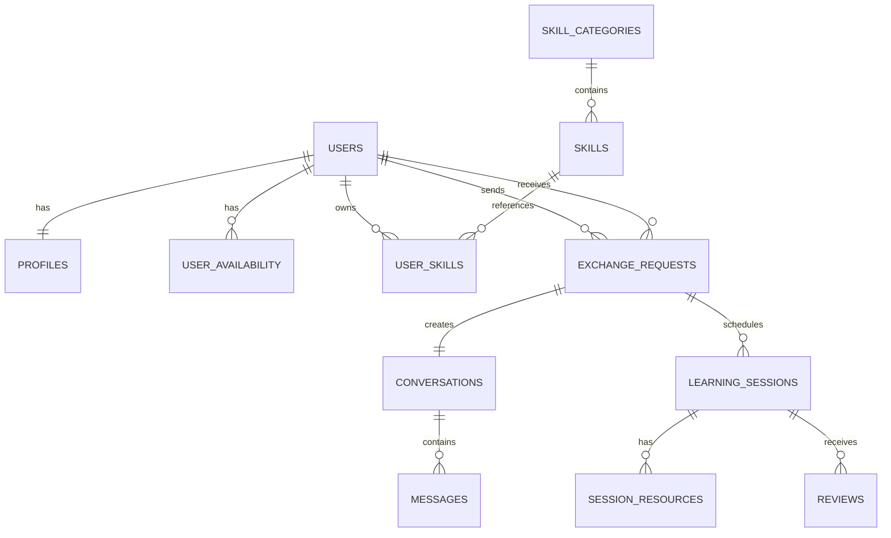

# SkillSwap Database Specification

> Version: 1.0.0
> Database: PostgreSQL (Supabase)

## Overview

This document defines the database design for the SkillSwap MVP.

## Core Tables

### users

**Purpose:**
Stores authentication credentials and the primary identity of every registered user.

| Column            | Type      | Nullable | Notes                        |
| ----------------- | --------- | -------- | ---------------------------- |
| id                | bigint    | No       | Primary Key                  |
| first_name        | string    | No       | User's first name            |
| middle_name       | string    | Yes      | User's middle name           |
| last_name         | string    | No       | User's last name             |
| suffix            | string    | Yes      | Jr., Sr., III, etc.          |
| username          | string    | No       | Unique public username       |
| email             | string    | No       | Unique email address         |
| password          | string    | No       | Hashed password (always NOT NULL — OAuth users get a random secure password) |
| email_verified_at | timestamp | Yes      | Email verification timestamp |
| remember_token    | string    | Yes      | Remember me token            |
| created_at        | timestamp | No       | Record creation              |
| updated_at        | timestamp | No       | Last update                  |

### Relationships

Has One

- Profile

Has Many

- SocialAccounts
- UserSkills
- ExchangeRequests (Sent)
- ExchangeRequests (Received)
- Messages
- Reviews

---

### Constraints

- Username must be unique.
- Email must be unique.
- Password must always be hashed.
- Email verification is optional until the user verifies their account.

---

### Indexes

- username
- email

---

### Notes

This table stores authentication and account identity only.

Public information such as biography, profile picture, teaching experience, availability, and social links should be stored in the `profiles` table.

Relationships:

- hasOne profile
- hasMany user_skills
- hasMany exchange_requests (sender)
- hasMany exchange_requests (receiver)

### social_accounts

**Purpose:** Links external OAuth provider accounts to SkillSwap users.

| Column         | Type      | Nullable | Notes                                         |
| -------------- | --------- | -------- | --------------------------------------------- |
| id             | bigint    | No       | Primary Key                                   |
| user_id        | bigint FK | No       | References users.id                            |
| provider       | string    | No       | OAuth provider name (e.g. 'google', 'github') |
| provider_id    | string    | No       | Unique identifier from the provider            |
| provider_email | string    | Yes      | Email from the provider (for auditing/debug)   |
| avatar_url     | string    | Yes      | External avatar URL from the provider          |
| created_at     | timestamp | No       | Record creation                                |
| updated_at     | timestamp | No       | Last update                                    |

### Constraints

- Unique per `(provider, provider_id)` — prevents duplicate provider links.
- Unique per `(user_id, provider)` — one link per provider per user.

### Notes

- OAuth-only users have their `password` set to `Hash::make(Str::random(64))`.
- The provider email is stored separately from the user's email for auditing.
- Users can link multiple providers to a single SkillSwap account.
- Provider `avatar_url` is stored as an external URL, not a local upload.

### profiles

**Purpose:** Public profile information.

| Column           | Type                                 |
| ---------------- | ------------------------------------ |
| id               | bigint                               |
| user_id          | bigint FK                            |
| bio              | text                                 |
| avatar           | string                               |
| location         | string                               |
| experience_level | enum(beginner,intermediate,advanced) |
| created_at       | timestamp                            |
| updated_at       | timestamp                            |

### user_availability

Purpose: Weekly availability.

| Column      | Type      |
| ----------- | --------- |
| id          | bigint    |
| user_id     | bigint FK |
| day_of_week | tinyint   |
| start_time  | time      |
| end_time    | time      |

### skill_categories

| Column | Type            |
| ------ | --------------- |
| id     | bigint          |
| name   | string unique   |
| slug   | string unique   |
| icon   | string nullable |

### skills

| Column      | Type          |
| ----------- | ------------- |
| id          | bigint        |
| category_id | bigint FK     |
| name        | string unique |
| slug        | string unique |

### user_skills

Purpose: User teaching/learning portfolio.

| Column              | Type                                        |
| ------------------- | ------------------------------------------- |
| id                  | bigint                                      |
| user_id             | bigint FK                                   |
| skill_id            | bigint FK                                   |
| type                | enum(teaching,learning)                     |
| title               | string                                      |
| description         | text                                        |
| experience_level    | enum(beginner,intermediate,advanced,expert) |
| years_of_experience | integer                                     |
| teaching_style      | string                                      |
| portfolio_url       | string nullable                             |

### exchange_requests

| Column            | Type                                                |
| ----------------- | --------------------------------------------------- |
| id                | bigint                                              |
| sender_id         | bigint FK(users)                                    |
| receiver_id       | bigint FK(users)                                    |
| teaching_skill_id | bigint FK(user_skills)                              |
| learning_skill_id | bigint FK(user_skills)                              |
| message           | text                                                |
| status            | enum(pending,accepted,declined,cancelled,completed) |

### conversations

| Column              | Type             |
| ------------------- | ---------------- |
| id                  | bigint           |
| exchange_request_id | bigint FK unique |

### messages

| Column          | Type               |
| --------------- | ------------------ |
| id              | bigint             |
| conversation_id | bigint FK          |
| sender_id       | bigint FK(users)   |
| body            | text               |
| read_at         | timestamp nullable |

### learning_sessions

| Column              | Type                                |
| ------------------- | ----------------------------------- |
| id                  | bigint                              |
| exchange_request_id | bigint FK                           |
| title               | string                              |
| description         | text                                |
| start_time          | timestamp                           |
| end_time            | timestamp                           |
| meeting_link        | string nullable                     |
| status              | enum(scheduled,completed,cancelled) |

### session_resources

| Column              | Type                                      |
| ------------------- | ----------------------------------------- |
| id                  | bigint                                    |
| learning_session_id | bigint FK                                 |
| title               | string                                    |
| url                 | string                                    |
| type                | enum(link,pdf,github,youtube,figma,other) |

### reviews

| Column              | Type             |
| ------------------- | ---------------- |
| id                  | bigint           |
| learning_session_id | bigint FK        |
| reviewer_id         | bigint FK(users) |
| reviewee_id         | bigint FK(users) |
| rating              | tinyint (1-5)    |
| comment             | text             |

## Mermaid ERD

## Future Tables

- notifications
- skill_credits
- ai_matches
- certificates
- group_learning
- video_calls

## Notes

- Authentication belongs in users.
- Public data belongs in profiles.
- Exchange requests drive the workflow.
- Conversations exist only after acceptance.
- Reviews require a completed learning session.
