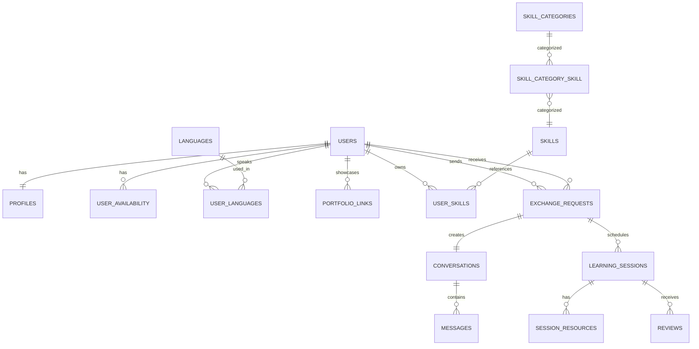

# SkillSwap Database Specification

> Version: 1.0.0
> Database: PostgreSQL (Supabase)

## Overview

This document defines the database design for the SkillSwap MVP.

## Core Tables

### roles

**Purpose:**
Defines user roles for the platform. Normalized design enables role lookup by slug instead of hardcoded IDs.

| Column | Type      | Nullable | Notes           |
| ------ | --------- | -------- | --------------- |
| id     | bigint    | No       | Primary Key     |
| name   | string    | No       | Display name    |
| slug   | string    | No       | Unique key      |
| created_at | timestamp | No    | Record creation |
| updated_at | timestamp | No    | Last update     |

**Seed data:**

| Name  | Slug  | Constant   |
| ----- | ----- | ---------- |
| Admin | admin | `Role::ADMIN` |
| User  | user  | `Role::USER`  |

**System roles:** Admin and User are system records. They are not user-managed data. Future administrative features must not allow deleting, renaming, or duplicating these roles.

### users

**Purpose:**
Stores authentication credentials and the primary identity of every registered user.

| Column            | Type      | Nullable | Notes                        |
| ----------------- | --------- | -------- | ---------------------------- |
| id                | bigint    | No       | Primary Key                  |
| role_id           | bigint FK | No       | References roles.id          |
| first_name        | string    | No       | User's first name            |
| middle_name       | string    | Yes      | User's middle name           |
| last_name         | string    | No       | User's last name             |
| suffix            | string    | Yes      | Jr., Sr., III, etc.          |
| username          | string    | No       | Unique public username       |
| email             | string    | No       | Unique email address         |
| password          | string    | No       | Hashed password (always NOT NULL — OAuth users get a random secure password) |
| email_verified_at | timestamp | Yes      | Email verification timestamp |
| remember_token    | string    | Yes      | Remember me token            |
| created_at        | timestamp | No       | Record creation              |
| updated_at        | timestamp | No       | Last update                  |

### Relationships

Belongs To

- Role

Has One

- Profile

Has Many

- SocialAccounts
- UserSkills
- ExchangeRequests (Sent)
- ExchangeRequests (Received)
- Messages
- Reviews

---

### Constraints

- Username must be unique.
- Email must be unique.
- Password must always be hashed.
- Email verification is optional until the user verifies their account.

---

### Indexes

- username
- email

---

### Notes

This table stores authentication and account identity only.

Public information such as biography, profile picture, teaching experience, availability, and social links should be stored in the `profiles` table.

Relationships:

- hasOne profile
- hasMany user_skills
- hasMany exchange_requests (sender)
- hasMany exchange_requests (receiver)

### social_accounts

**Purpose:** Links external OAuth provider accounts to SkillSwap users.

| Column         | Type      | Nullable | Notes                                         |
| -------------- | --------- | -------- | --------------------------------------------- |
| id             | bigint    | No       | Primary Key                                   |
| user_id        | bigint FK | No       | References users.id                            |
| provider       | string    | No       | OAuth provider name (e.g. 'google', 'github') |
| provider_id    | string    | No       | Unique identifier from the provider            |
| provider_email | string    | Yes      | Email from the provider (for auditing/debug)   |
| avatar_url     | string    | Yes      | External avatar URL from the provider          |
| created_at     | timestamp | No       | Record creation                                |
| updated_at     | timestamp | No       | Last update                                    |

### Constraints

- Unique per `(provider, provider_id)` — prevents duplicate provider links.
- Unique per `(user_id, provider)` — one link per provider per user.

### Notes

- OAuth-only users have their `password` set to `Hash::make(Str::random(64))`.
- The provider email is stored separately from the user's email for auditing.
- Users can link multiple providers to a single SkillSwap account.
- Provider `avatar_url` is stored as an external URL, not a local upload.

### profiles

**Purpose:** Stores the user's public profile information, separate from authentication credentials.

| Column           | Type                                  | Nullable | Default  | Notes                                    |
| ---------------- | ------------------------------------- | -------- | -------- | ---------------------------------------- |
| id               | bigint                                | No       | —        | Primary Key                              |
| user_id          | bigint FK                             | No       | —        | References users.id, cascade on delete   |
| bio              | text                                  | Yes      | NULL     | Max 500 characters                       |
| headline         | string(100)                           | Yes      | NULL     | Short tagline — added in Phase 4 migration |
| avatar           | string(255)                           | Yes      | NULL     | Relative path to stored avatar file      |
| location         | string(100)                           | Yes      | NULL     | Free-text location (city, country)       |
| website          | string(200)                           | Yes      | NULL     | Personal website URL — added in Phase 4 migration |
| timezone         | string(50)                            | Yes      | NULL     | IANA timezone identifier (e.g. "Asia/Manila") |
| experience_level | string(20)                            | No       | 'beginner' | Enum: beginner, intermediate, advanced  |
| created_at       | timestamp                             | No       | —        | Record creation                          |
| updated_at       | timestamp                             | No       | —        | Last update                              |

### Constraints

- `user_id` is unique — each user has exactly one profile record.
- `bio`, `headline`, `avatar`, `location`, and `website` are nullable — new users can have empty profiles.
- `experience_level` defaults to `'beginner'` and is constrained to valid values in the application layer.

### Indexes

- user_id (unique)

### Notes

- The `avatar` column stores a relative path (e.g., `avatars/abc123.jpg`). The API returns the full URL constructed via Laravel's `Storage::url()`.
- Deleting a user cascades to delete their profile record.
- Profile creation is handled automatically when the user first updates their profile (`firstOrCreate` pattern).

---

### user_availability

**Purpose:** Stores the user's weekly recurring availability slots for scheduling learning sessions.

| Column      | Type        | Nullable | Default | Notes                                    |
| ----------- | ----------- | -------- | ------- | ---------------------------------------- |
| id          | bigint      | No       | —       | Primary Key                              |
| user_id     | bigint FK   | No       | —       | References users.id, cascade on delete   |
| day_of_week | tinyint     | No       | —       | 0=Sunday, 1=Monday, ..., 6=Saturday      |
| start_time  | time        | No       | —       | Start of availability block (H:i:s)      |
| end_time    | time        | No       | —       | End of availability block (H:i:s)        |
| created_at  | timestamp   | No       | —       | Record creation                          |
| updated_at  | timestamp   | No       | —       | Last update                              |

### Constraints

- `day_of_week` must be between 0 and 6 (validated in application layer).
- `start_time` must be before `end_time` (validated in application layer).
- No unique constraint on `(user_id, day_of_week)` — users can have multiple slots per day.

### Indexes

- user_id

### Notes

- Availability is managed as a full replacement — the client sends the complete schedule and the backend deletes all existing slots before inserting the new ones.
- No server-side overlap validation. The frontend should prevent overlapping slots.
- An empty set of slots indicates the user has not set their availability.

### languages

**Purpose:** Reference table of languages (CLDR source of truth). System-managed — users cannot create, edit, or delete entries.

| Column      | Type               | Nullable | Notes                              |
| ----------- | ------------------ | -------- | ---------------------------------- |
| id          | bigint             | No       | Primary Key                        |
| code        | string(10)         | No       | Unique ISO 639-1 code (e.g. "en") |
| name        | string(100)        | No       | English name (e.g. "English")      |
| native_name | string(100)        | Yes      | Name in the language itself (e.g. "English", "Español") |
| sort_order  | unsigned smallint  | No       | Display order for the UI           |
| created_at  | timestamp          | No       | Record creation                    |
| updated_at  | timestamp          | No       | Last update                        |

**Seed data:** Curated CLDR subset of ~150 languages via LanguageSeeder. Inclusion criteria: ISO 639-1 code, significant speaker population, regional relevance.

### user_languages

**Purpose:** Pivot table linking users to their communication languages with proficiency level.

| Column      | Type               | Nullable | Notes                              |
| ----------- | ------------------ | -------- | ---------------------------------- |
| id          | bigint             | No       | Primary Key                        |
| user_id     | bigint FK          | No       | References users.id, cascade on delete |
| language_id | bigint FK          | No       | References languages.id, cascade on delete |
| proficiency | string(20)         | No       | Validated in application layer: native, fluent, intermediate, beginner |
| created_at  | timestamp          | No       | Record creation                    |
| updated_at  | timestamp          | No       | Last update                        |

**Constraints:**
- Unique per `(user_id, language_id)` — each language can be added once per user
- Proficiency validated at the application level (not a DB enum)

### portfolio_links

**Purpose:** Stores a user's external portfolio and social profile links. Each user can have multiple links across 11 supported platforms.

| Column        | Type               | Nullable | Notes                              |
| ------------- | ------------------ | -------- | ----------------------------------- |
| id            | bigint             | No       | Primary Key                        |
| user_id       | bigint FK          | No       | References users.id, cascade on delete |
| platform      | string(30)         | No       | Validated in app layer: github, gitlab, linkedin, behance, dribbble, figma, codepen, youtube, medium, devto, website |
| url           | string(500)        | No       | Validated via platform-aware regex (`ValidPortfolioUrl` rule) |
| display_order | unsigned smallint  | No       | 0-indexed, compaction on delete    |
| created_at    | timestamp          | No       | Record creation                    |
| updated_at    | timestamp          | No       | Last update                        |

**Constraints:**
- No unique constraint on platform — users can have multiple links per platform
- URL validation is platform-aware (github.com/... pattern for GitHub, linkedin.com/in/... for LinkedIn, etc.)
- The "website" platform accepts any valid http(s) URL (replaces the legacy `profiles.website` column for new entries)

**Indexes:**
- user_id

**Notes:**
- Managed as full replacement during profile update (delete all + recreate)
- Individual CRUD also available via dedicated endpoints
- `display_order` is compacted when a link is deleted
- Reorder via dedicated endpoint that accepts ordered IDs

### skill_categories

**Purpose:** Reference table for skill categories (system-managed). Users cannot create, edit, or delete categories.

| Column      | Type               | Nullable | Default | Notes                       |
| ----------- | ------------------ | -------- | ------- | --------------------------- |
| id          | bigint             | No       | —       | Primary Key                 |
| name        | string             | No       | —       | Display name (unique)       |
| slug        | string             | No       | —       | URL-friendly identifier (unique) |
| icon        | string             | Yes      | NULL    | Icon identifier for UI      |
| sort_order  | unsigned smallint  | No       | 0       | Display order in the UI     |
| created_at  | timestamp          | No       | —       | Record creation             |
| updated_at  | timestamp          | No       | —       | Last update                 |

**Constraints:**
- `name` is unique
- `slug` is unique
- System-managed — no public create/edit/delete endpoints

**Indexes:**
- name
- slug

### skills

**Purpose:** Reference table of skills (system-managed). A skill can belong to multiple categories via the `skill_category_skill` pivot table. Users cannot create, edit, or delete skills directly.

| Column      | Type               | Nullable | Default | Notes                       |
| ----------- | ------------------ | -------- | ------- | --------------------------- |
| id          | bigint             | No       | —       | Primary Key                 |
| name        | string             | No       | —       | Display name (unique, case-insensitive normalized) |
| slug        | string             | No       | —       | URL-friendly identifier (unique) |
| sort_order  | unsigned smallint  | No       | 0       | Display order               |
| is_system   | boolean            | No       | false   | True for seeded skills, false for user-created |
| created_by  | bigint FK          | Yes      | NULL    | References users.id — null for seeded skills |
| created_at  | timestamp          | No       | —       | Record creation             |
| updated_at  | timestamp          | No       | —       | Last update                 |

**Constraints:**
- `name` is unique (case-insensitive normalized)
- `slug` is unique
- System-managed — no public create/edit/delete endpoints
- `is_system` = true for seeded skills (SkillCategorySeeder), false for user-created skills
- `created_by` = null for seeded skills, authenticated user ID for user-created skills
- `is_system` and `created_by` are internal metadata — never exposed in API responses
- Skill-to-category relationships are stored in the `skill_category_skill` pivot table

**Indexes:**
- name
- slug

### skill_category_skill

**Purpose:** Pivot table linking skills to categories (many-to-many). A skill can belong to one or more categories; a category can contain one or more skills.

| Column            | Type      | Nullable | Notes                              |
| ----------------- | --------- | -------- | ---------------------------------- |
| id                | bigint    | No       | Primary Key                        |
| skill_category_id | bigint FK | No       | References skill_categories.id, cascade on delete |
| skill_id          | bigint FK | No       | References skills.id, cascade on delete |
| created_at        | timestamp | No       | Record creation                    |
| updated_at        | timestamp | No       | Last update                        |

**Constraints:**
- Unique per `(skill_category_id, skill_id)` — prevents duplicate category-skill relationships
- Both foreign keys cascade on delete — removing a category or skill cleans up pivot rows

**Indexes:**
- Unique composite index on `(skill_category_id, skill_id)`

### user_skills

**Purpose:** Stores the skills a user teaches or wants to learn. Each user can have multiple skills, each with its own experience level, description, and featured status.

| Column              | Type                                        | Nullable | Default    | Notes                              |
| ------------------- | ------------------------------------------- | -------- | ---------- | ---------------------------------- |
| id                  | bigint                                      | No       | —          | Primary Key                        |
| user_id             | bigint FK                                   | No       | —          | References users.id, cascade on delete |
| skill_id            | bigint FK                                   | No       | —          | References skills.id, cascade on delete |
| type                | string                                      | No       | —          | 'teaching' or 'learning' (validated in app layer) |
| title               | string(100)                                 | Yes      | NULL       | Custom title for this skill entry; null displays skill.name instead |
| description         | text                                        | Yes      | NULL       | Free-text description of proficiency or learning goals |
| experience_level    | string                                      | No       | 'beginner' | 'beginner', 'intermediate', 'advanced', 'expert' |
| years_of_experience | integer                                     | Yes      | NULL       | Validated: 0–60, nullable           |
| teaching_style      | string                                      | Yes      | NULL       | Free-text teaching approach description |
| featured            | boolean                                     | No       | false      | True if user wants to highlight this skill (max 3 per user) |
| portfolio_url       | string                                      | Yes      | NULL       | **Deprecated.** Use portfolio_links table instead. Column retained for data preservation; not exposed in API or frontend. |
| created_at          | timestamp                                   | No       | —          | Record creation                    |
| updated_at          | timestamp                                   | No       | —          | Last update                        |

**Constraints:**
- Unique per `(user_id, skill_id, type)` — a user cannot add the same skill for the same purpose twice, but can teach AND learn the same skill simultaneously.
- `type` validated at application layer (`in:teaching,learning`).
- `experience_level` validated at application layer (`in:beginner,intermediate,advanced,expert`).
- `featured` — maximum 3 featured skills per user, enforced at application layer.
- `years_of_experience` — nullable, integer, min:0, max:60, validated at application layer.

**Indexes:**
- user_id
- skill_id
- type
- Unique composite index on `(user_id, skill_id, type)`

**Notes:**
- `portfolio_url` is **deprecated**. Do not use in any API resource, form request, or frontend component. The `portfolio_links` table (Phase 4.6) is the current mechanism for external profile/portfolio links. The column will be removed in a future cleanup migration.

### exchange_requests

| Column            | Type                                                |
| ----------------- | --------------------------------------------------- |
| id                | bigint                                              |
| sender_id         | bigint FK(users)                                    |
| receiver_id       | bigint FK(users)                                    |
| teaching_skill_id | bigint FK(user_skills)                              |
| learning_skill_id | bigint FK(user_skills)                              |
| message           | text                                                |
| status            | enum(pending,accepted,declined,cancelled,completed) |

### conversations

| Column              | Type             |
| ------------------- | ---------------- |
| id                  | bigint           |
| exchange_request_id | bigint FK unique |

### messages

| Column          | Type               |
| --------------- | ------------------ |
| id              | bigint             |
| conversation_id | bigint FK          |
| sender_id       | bigint FK(users)   |
| body            | text               |
| read_at         | timestamp nullable |

### learning_sessions

| Column              | Type                                |
| ------------------- | ----------------------------------- |
| id                  | bigint                              |
| exchange_request_id | bigint FK                           |
| title               | string                              |
| description         | text                                |
| start_time          | timestamp                           |
| end_time            | timestamp                           |
| meeting_link        | string nullable                     |
| status              | enum(scheduled,completed,cancelled) |

### session_resources

| Column              | Type                                      |
| ------------------- | ----------------------------------------- |
| id                  | bigint                                    |
| learning_session_id | bigint FK                                 |
| title               | string                                    |
| url                 | string                                    |
| type                | enum(link,pdf,github,youtube,figma,other) |

### reviews

| Column              | Type             |
| ------------------- | ---------------- |
| id                  | bigint           |
| learning_session_id | bigint FK        |
| reviewer_id         | bigint FK(users) |
| reviewee_id         | bigint FK(users) |
| rating              | tinyint (1-5)    |
| comment             | text             |

## Mermaid ERD

## Future Tables

- notifications
- skill_credits
- ai_matches
- certificates
- group_learning
- video_calls

## Notes

- Authentication belongs in users.
- Public data belongs in profiles.
- Exchange requests drive the workflow.
- Conversations exist only after acceptance.
- Reviews require a completed learning session.
